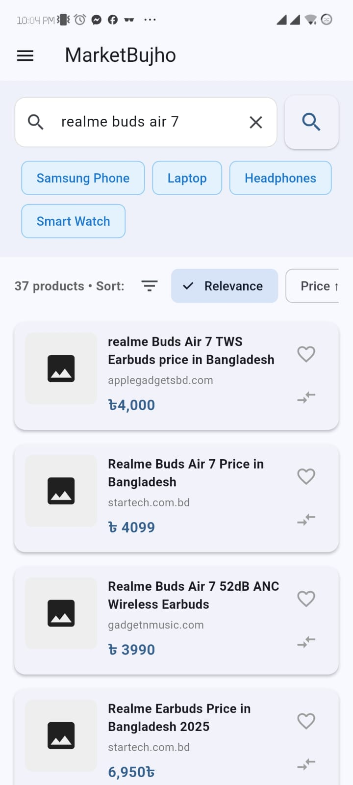
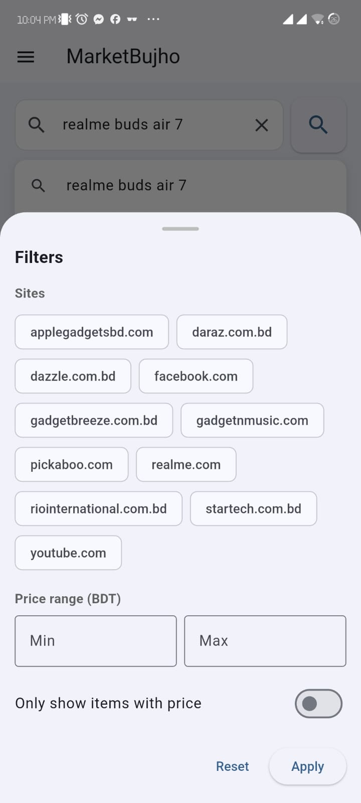
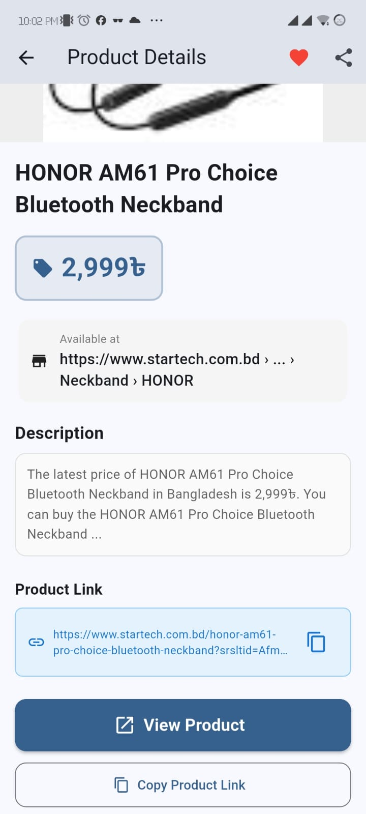
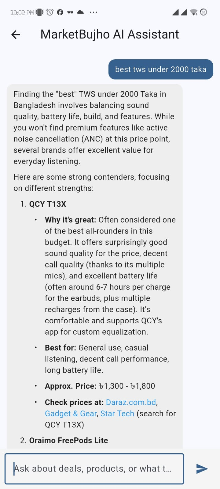

# MarketBujho
### Intelligent BD Shopping Assistant

A Flutter-based mobile application that acts as an intelligent shopping assistant for Bangladeshi e-commerce users. MarketBujho aggregates product data from multiple sources, provides AI-powered shopping advice, and helps users compare prices and manage their wishlists.

**Software Development Project II (SDP-2)**  
**Bangladesh University of Professionals**  
Faculty of Science & Technology | Department of Computer Science & Engineering (CSE)

---

## Table of Contents

- [Overview](#overview)
- [Features](#features)
- [Screenshots](#screenshots)
- [Technology Stack](#technology-stack)
- [Architecture](#architecture)
- [Getting Started](#getting-started)
- [Project Structure](#project-structure)
- [Key Features Guide](#key-features-guide)
- [System Logic](#system-logic)
- [Team](#team)
- [Limitations & Future Work](#limitations--future-work)

---

## Overview

The e-commerce landscape in Bangladesh is expanding rapidly, yet consumers struggle with fragmented pricing information across different platforms. MarketBujho simplifies this by providing a centralized search engine for local e-commerce websites with integrated AI-powered shopping assistance.

**Main Objectives:**
- Aggregate product data from multiple Bangladeshi e-commerce sources
- Enable intelligent product search and price comparison
- Provide AI-driven personalized shopping recommendations
- Support structured wishlist management with notes and categories
- Consolidate trending offers from major retailers in one place

---

## Features

### 🔐 Authentication System
- Email/Password registration and login
- Google Sign-In integration via Firebase
- Password recovery functionality
- Secure credential management

### 🔍 Search & Discovery
- Multi-source product search via Serper API
- Dynamic filtering and sorting (by relevance, price)
- Local search history with suggestions
- Price information extraction and normalization

### 💰 Price Comparison
- Real-time product details and pricing
- Open original product links in browser
- Share products via multiple channels
- Price-based sorting and filtering

### ❤️ Wishlist Management
- Add/remove products from personal wishlist
- Custom notes and category organization
- Price drop notifications (simulated in current version)
- Wishlist persistence via Cloud Firestore

### 📊 Trending Offers
- Aggregated deals from major BD retailers:
  - Startech
  - Techland
  - Apple Gadgets
  - Ryans
  - Sumash Tech
- Web scraping-based offer extraction
- Consolidated view of special deals

### 🤖 AI Shopping Assistant
- Powered by Google Gemini API
- Bangladeshi market-aware recommendations
- Context-aware product advice
- Chat-style conversational interface

### 📱 Notifications
- Local notification system
- Price drop alerts
- Wishlist updates

---

## Screenshots

### Authentication System

|  |  |
|:---:|:---:|
| **Figure 1:** Register Screen - Create new account with email and password | **Figure 2:** Login Screen - Sign in with email/password or Google |

### Dashboard & Search

|  |  |
|:---:|:---:|
| **Figure 3:** Main Dashboard - Search bar, quick categories, and recently viewed products | **Figure 4:** Product Search - Sorting options by relevance and price |

|  |
|:---:|
| **Figure 5:** Product Search - Filter results and compare prices across multiple retailers |

### Product & Wishlist Management

|  |  |
|:---:|:---:|
| **Figure 6:** Product Details - View full product info, price, and source retailer | **Figure 7:** Wishlist - Organize products by categories with custom notes |

### Trending Offers & AI Assistant

|  |  |
|:---:|:---:|
| **Figure 8:** Trending Offers - Aggregated deals from major BD retailers | **Figure 9:** AI Shopping Assistant - Chat-based personalized recommendations |

---

## Technology Stack

| Component | Technology |
|---|---|
| **Frontend** | Flutter (Dart) |
| **State Management** | Provider pattern |
| **Database** | Cloud Firestore |
| **Authentication** | Firebase Authentication |
| **AI Integration** | Google Gemini API |
| **Search Engine** | Serper API |
| **Web Scraping** | Dart http & html packages |
| **Notifications** | flutter_local_notifications |
| **Local Storage** | shared_preferences |

---

## Architecture

MarketBujho follows a **three-layer architecture**:

### Presentation Layer
- Login & Registration screens
- Dashboard with navigation
- Product search and details screens
- Wishlist management UI
- Trending offers view
- AI Assistant chat interface

### Application Logic Layer
- **Provider Pattern** for state management
- Change notifier classes:
  - Authentication Provider
  - Wishlist Provider
  - Notification Provider
  - Comparison Provider
  - AI Assistant Provider

### Data Layer
- Cloud Firestore for persistent storage
- Serper API for search results
- Gemini API for AI responses
- Web scraping services for trending offers
- Local shared preferences for caching

---

## Getting Started

### Prerequisites
- Flutter SDK (>=3.0.0)
- Dart 3.0.0 or higher
- Android SDK or iOS development environment
- Firebase project setup
- API keys:
  - Google Firebase credentials
  - Serper API key
  - Google Gemini API key

### Installation

1. **Clone the repository:**
   ```bash
   git clone https://github.com/Bruhther-64bit/MarketBujhoFinal.git
   cd MarketBujhoFinal
   ```

2. **Install dependencies:**
   ```bash
   flutter pub get
   ```

3. **Configure Firebase:**
   - Place `google-services.json` in `android/app/` (not included in repo for security)
   - Place `GoogleService-Info.plist` in `ios/Runner/` (not included in repo for security)

4. **Set up API keys:**
   - Create `lib/firebase_options.dart` with your Firebase configuration
   - Add Serper API and Gemini API keys to your environment

5. **Run the application:**
   ```bash
   flutter run
   ```

---

## Project Structure

```
lib/
├── main.dart                 # Application entry point
├── screens/
│   ├── login_screen.dart
│   ├── register_screen.dart
│   ├── dashboard_screen.dart
│   ├── search_screen.dart
│   ├── product_details_screen.dart
│   ├── wishlist_screen.dart
│   ├── trending_offers_screen.dart
│   └── ai_assistant_screen.dart
├── providers/
│   ├── auth_provider.dart
│   ├── wishlist_provider.dart
│   ├── notification_provider.dart
│   ├── comparison_provider.dart
│   └── ai_assistant_provider.dart
├── services/
│   ├── firebase_service.dart
│   ├── serper_search_service.dart
│   ├── gemini_ai_service.dart
│   ├── scraping_service.dart
│   └── notification_service.dart
├── models/
│   ├── product_model.dart
│   ├── user_model.dart
│   └── wishlist_item_model.dart
└── widgets/
    ├── product_card.dart
    ├── custom_app_bar.dart
    └── custom_input_field.dart
```

---

## Key Features Guide

### Authentication
- Users can register with email/password or Google Sign-In
- Password reset functionality via Firebase
- Session persistence using Firebase Authentication tokens

### Search & Filter
- Queries are enhanced with Bangladesh-specific keywords
- Results filtered for product pages only
- Sorting options: Relevance, Price (Low to High), Price (High to Low)
- Local search history stored in shared_preferences

### Wishlist
- Add products from search results
- Organize by categories (Phones, Gifts, Accessories, etc.)
- Add custom notes for each item
- Simulated price drop notifications
- Persistent storage in Cloud Firestore

### AI Shopping Assistant
- Context-aware recommendations based on user queries
- Bangladeshi market knowledge
- Real-time responses via Gemini API
- Chat interface with conversation history

### Trending Offers
- Automated scraping of major retailer offer pages
- Updates aggregated in single consolidated view
- HTML parsing for product extraction

---

## System Logic

### Data Management Strategy
Consistent product model used across:
- Search results
- Wishlist entries
- Trending offers
- AI context

### Search Engine Integration
1. User enters query → Cleaned and localized
2. Sent to Serper API → Receives Google search results
3. Parsed for product pages → Price extraction
4. Sorted by user preference → Displayed in UI

### AI Service Behavior
1. User prompt received
2. Custom context prompt added (Bangladesh shopping advisor)
3. Combined prompt sent to Gemini API
4. Response parsed and displayed in chat UI

### Web Scraping Workflow
1. Retailer offer page fetched via HTTP
2. HTML parsed for product cards
3. Data extracted (title, image, link)
4. Mapped to product model
5. Displayed in trending offers view

### Notifications
- Local notifications via `flutter_local_notifications`
- Simulated price drop triggers notification
- Future: Real-time notifications via Firebase Cloud Messaging

---

## Team

| Name | ID | Role |
|---|---|---|
| Zulqarnain Talukder | 2252421021 | Lead Developer |
| Samiul Haque Siddique | 2252421045 | Backend/Firebase |
| Md. Monir Hossain | 2252421053 | UI/UX Developer |
| Al Rafi Al Islam | 2252421079 | AI Integration |

**Submitted to:**
- Lecturer Iyolita Islam (Dept. of CSE, Bangladesh University of Professionals)
- Lecturer Sharad Hasan (Dept. of Data Science, Gazipur Digital University)

---

## Limitations & Future Work

### Current Limitations
- Web scraping approach is dependent on retailer website stability
- Prices from search results may lag behind real-time values
- No server-side price tracking or backend cron jobs
- Notifications are simulated locally (no real-time updates)

### Future Enhancements
- **Backend Service**: Dedicated server with scheduled price tracking tasks
- **Real-time Notifications**: Firebase Cloud Messaging for push notifications
- **Enhanced AI**: Multi-turn conversation memory in AI Assistant
- **Voice Search**: Voice query input and audio responses
- **Social Features**: Public wishlist sharing and community reviews
- **Mobile Optimization**: Performance improvements for low-bandwidth scenarios
- **Additional Retailers**: Expand scraping to more e-commerce platforms

---

## Security Considerations

⚠️ **Important:** Firebase configuration files and API keys are NOT included in this repository for security reasons.

Before making this repository public:
- ✅ Remove sensitive Firebase credentials from git history
- ✅ Update `.gitignore` to exclude configuration files
- ✅ Rotate all exposed API keys from Google Cloud Console
- ✅ Use environment variables for production API keys

---

## License

This project is submitted as part of Software Development Project II (SDP-2) at Bangladesh University of Professionals.

---

## Support & Contact

For questions or issues regarding this project, please contact the development team through the Bangladesh University of Professionals CSE Department.

---

**Last Updated:** December 7, 2025

**Repository:** [MarketBujhoFinal](https://github.com/Bruhther-64bit/MarketBujhoFinal)
